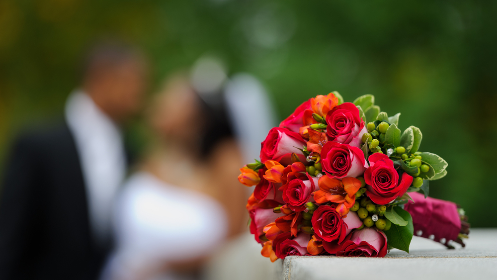

Although your wedding day might be the most important day in your life and you want to have a huge celebration and look exquisite, it is simply not worth it to start your married life in debt. Have a look at what you need to consider and how you should go about planning and saving for your wedding.

### How much do you actually need?

The average cost of a wedding in South Africa can be up to R70 000\. This might be a lot more than you can or want to spend on a wedding. Let’s work on a budget of R50 000\. This breakdown will help you decide how much money you actually need. Once you have an idea you can then decide how to readjust the costs according to your specific needs. You might want to spend less on flowers but more on your dress.

* Reception (venue, catering): 48 percent or R24 000
* Ceremony: 2 percent or R1 000
* The dress/The suits: 8 percent or R4 000
* Flowers/ decorations: 6 percent or R3 000
* Entertainment/Music: 10 percent or R5 000
* Photography/Videography: 10 percent or R5 000
* Stationery: 2 percent or R1 000
* Wedding Rings: 3 percent or R1 500
* Parking/Transportation: 3 percent or R1500
* Gifts: 2 percent or R1 000
* Miscellaneous: 6 percent or R3 000

### What can you do cheaper?

If you need to cut costs think about the following suggestions. Remember, it is your wedding and as a couple you must decide what is important to you and what you will be happy to do without.

* Winter weddings are cheaper than summer weddings.
* Venue costs differ vastly.
* Is there someone in your family that can do the catering?
* You could invite fewer guests
* You could ask your parents if they would be willing to contribute
* You could have a cash bar at the reception and only serve wine.
* You could hire your wedding dress

### How can you save?

Give yourself enough time to save for the wedding. Ideally at least 6 months. Because you know when you will need the money it is best to save it in an account that bears a higher interest rate. This account should be separate and only for your wedding savings and expenses.

Make sure that you deposit a set amount into this account every month.  The best way to know how much you must save every month is to take the total costs and divide that by the number of months you have to save. For example: If your wedding is going to costs R50 000 and you have 6 months to save you and your fiancée must save R8 500 per month. If this is not possible then you need a longer period to save.

It is much better to find the money to save upfront than pay it back as a loan for years to come. Every cent you use to pay for the debt of your wedding, takes you one step away from buying a house or starting a nest gg as a couple.

### What else should you consider?

Every couple is different and you might have traditions and family obligations to consider as well. Do you need to pay lobola? Do you need to have a traditional wedding and a white wedding? Have you talked about your marital regime? Do you know the difference between the three marital regimes in South Africa.

### Don’t argue about money!

Finances are one of the biggest reasons for arguments between couples. Sit down with your intended spouse and discuss not only the costs related to your big day, but also how you will run your finances and look after your financial wellbeing as a couple in future. Make sure that your financial habits are in sync and that you share similar dreams for your future together.